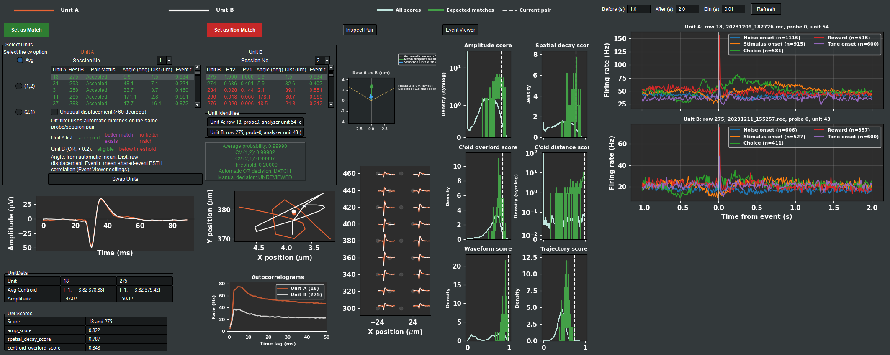

# UnitMatch

UnitMatch matches electrophysiological units within and across recording
sessions using waveform and spatial features.

This repository contains the Python implementations:

- **UnitMatchPy** for probabilistic unit matching and manual review.
- **DeepUnitMatch** for deep-learning-based matching.

## Changes from the original UnitMatch repository

This fork builds on [EnnyvanBeest/UnitMatch](https://github.com/EnnyvanBeest/UnitMatch),
the original upstream project. The matching method and its scientific attribution
remain upstream's; the additions here focus on SpikeInterface workflows and
interactive review. This is a Python-focused distribution and does not include
the original MATLAB implementation.

| Area | Additions in this fork |
| --- | --- |
| SpikeInterface integration | Export UnitMatch inputs from prepared sorting analyzers, review within-session merge groups, and save curated analyzers explicitly. Shared diagnostic helpers reuse stored waveform samples rather than computing extensions during review. |
| Manual review | Scrollable, color-coded Unit A and Unit B tables; separate session and CV selection; explicit green **Set as Match** and red **Set as Non Match** buttons; selectable original unit/probe identities and pair lookup. |
| Spatial diagnostics | Raw displacement magnitude and angle in both tables, a larger equal-scale displacement map, and dashed 60-degree boundaries around the automatic-match mean for each probe/session pair. The unusual-displacement filter affects Unit A only, leaving every Unit B alternative accessible. |
| Event responses | A linked Event Viewer compares event-aligned firing rates. Both tables show cached, asynchronously computed shared-event PSTH correlations without changing match probabilities or decisions. |
| Plotting and notebooks | Wider average waveforms, larger raw-waveform and score panels, visible legend handles, spike-aware histogram scaling, and nonblocking IPython/Tk review. Reopening an active review focuses the existing window. |

Upstream already provides waveform/spatial matching, manual review, and functional
validation tools. The additions above extend that workflow; they are not a new
matching algorithm or a claim that functional validation originated in this fork.

### Review colors and diagnostics

**Unit A:** green means the listed pair is accepted. Purple means it is not
accepted and an accepted better-or-tied alternative, ranked by average match
probability, shares either endpoint within the same session pair. Red means no
such accepted alternative exists. Its angle, distance, and **Event r** refer to
that row's listed **Best B**, not necessarily the currently selected Unit B.

**Unit B:** green means the pair exceeds the automatic threshold in either CV
direction (**OR**) or both directions (**AND**), according to the selected rule;
red means it does not. Eligibility is not the same as acceptance after conflict
resolution. Its diagnostics always use the currently selected Unit A.

**Event r** is the equal-weight mean of Pearson correlations between
trial-averaged PSTHs for usable shared event types, with the Event Viewer's
current windows and bin size. Missing or undefined results are shown as `n/a`,
not zero. These values are review evidence, not calibrated identity probabilities
or automatic matching criteria. Selecting matches by response similarity can
bias later analyses of functional stability or plasticity.

### Tk review and Event Viewer



The screenshot combines captures of the two application windows side by side.
See the [Python usage guide](UnitMatchPy/README.md) for the review controls and
notebook integration.

## Installation

For the original published package:

```bash
pip install UnitMatchPy
```

For this fork's changes, clone this repository, check out the branch containing
them, and install from its package subdirectory:

```bash
cd UnitMatchPy
pip install -e ".[full,notebooks]"
```

See [UnitMatchPy/README.md](UnitMatchPy/README.md) for requirements, GPU setup,
demo notebooks, and detailed usage.

## References

- [UnitMatch paper](https://www.nature.com/articles/s41592-024-02440-1)
- [DeepUnitMatch preprint](https://www.biorxiv.org/content/10.64898/2026.01.30.702777v1)
- [Original UnitMatch repository](https://github.com/EnnyvanBeest/UnitMatch)

Original UnitMatch was developed by Enny H. van Beest and Celian Bimbard.
UnitMatchPy was developed by Sam Dodgson. DeepUnitMatch was developed by
Wentao Qiu and Suyash Agarwal.

## License

See [LICENSE](LICENSE).
